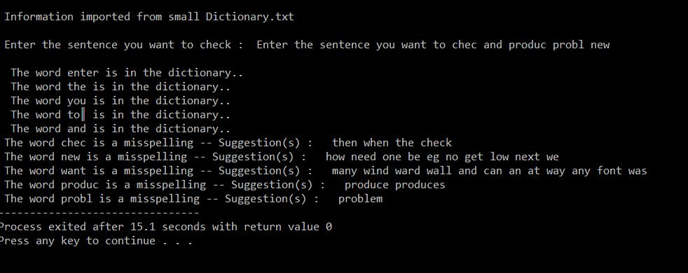

# Word-Suggestion

> **Analysis of Algorithm Assignment-3 (3rd year of University)**

# Assignment

If there are misspelled words in a questioned sentence, a system will be designed to suggest correct words instead of these words.

Check detailed assignment [description](https://github.com/uguraltindal/Word-Suggestion/blob/main/BLM3021_Assignment_3.pdf).

## Example

The words in the sentence entered by the user should be checked one by one and suggestions should be made to the user. If the word is not in the dictionary, words with a **maximum difference of 2** should be suggested from the dictionary. Code is [here](https://github.com/uguraltindal/Word-Suggestion/blob/main/WordSuggestion.c).

